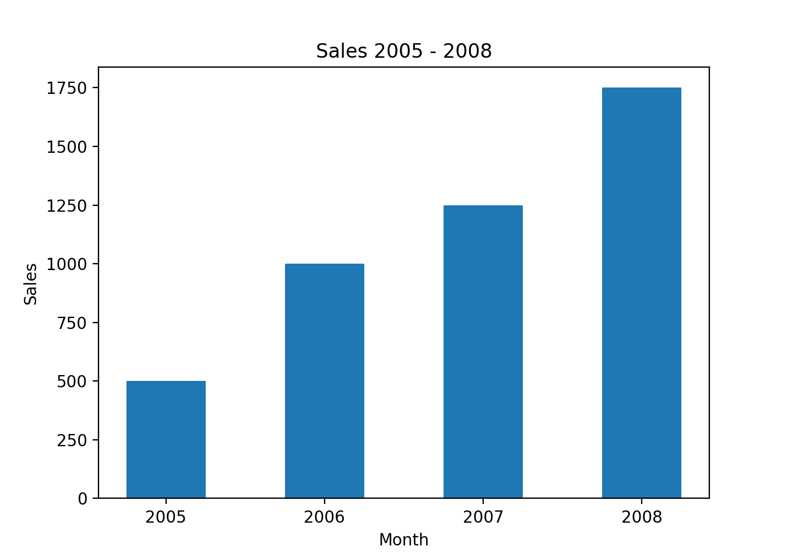
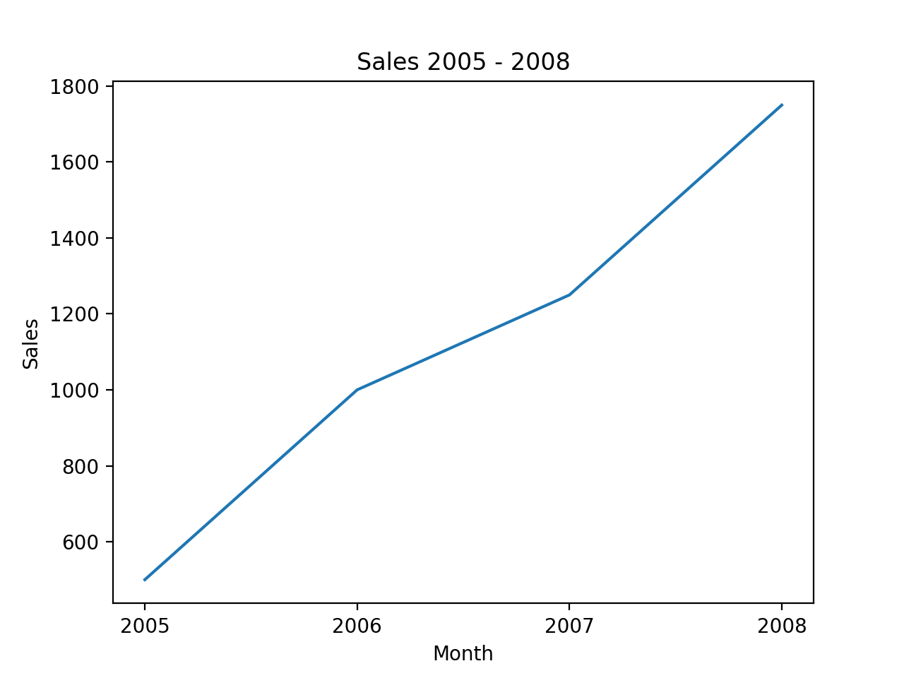

# Simply Plot

simplyplot is a wrapper built around the matplotlib framework. The purpose of
this wrapper is to make it easier to create basic graphs with less lines of code.

## Installation
```bash
pip install simplyplot
```

## Dependicies

- matplotlib

# Example
## Bar chart
```language=python
import simplyplot

options = {
	'title': 'Sales 2005 - 2008',
	'x_axis_name': 'Month',
	'y_axis_name': 'Sales',
	'data': (2000, 1500, 2250, 1750),
	'labels': ('2005', '2006', '2007', '2008')
}

monthly_sales = simplyplot.BarChart(**options)

monthly_sales.show()
```

### Result

</img>

## Line chart

```language=python
import simplyplot

options = {
	'title': 'Sales 2005 - 2008',
	'x_axis_name': 'Month',
	'y_axis_name': 'Sales',
	'data': (2000, 1500, 2250, 1750),
	'labels': ('2005', '2006', '2007', '2008')
}

monthly_sales = simplyplot.LineChart(**options)

monthly_sales.show()
```

### Result

</img>

## To-do

- Make proper tests
- Add some more graph types
- Add support for figures, and adding graphs to figures
